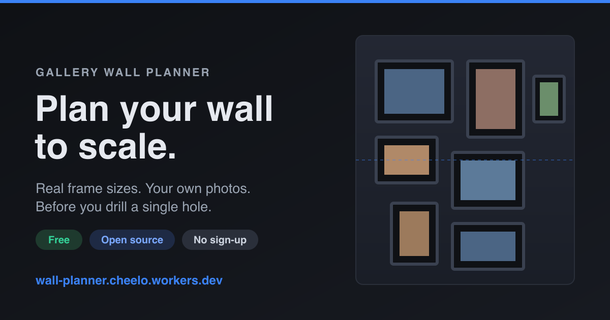

# Gallery Wall Planner

**[▶ Live demo](https://wall-planner.cheelo.workers.dev/)** · free · open source · no sign-up



Mock up a gallery wall before you put a single nail in the drywall. Set your wall
(a photo of it, or a blank sized canvas), add frame styles at their real dimensions,
drop in your photos, crop/rotate them, and arrange everything by hand or with
auto-layouts. Everything renders at real-world scale, so the proportions you see
match the physical wall.

Runs entirely in the browser. No backend, no accounts, no uploads — your images
and layout live in `localStorage` on your machine.

## Features

**Set up the wall**

- **Two wall modes** — upload a photo of your actual wall, or start from a blank area
  at a size you type in. Presets ("Over a sofa 84×48", "Hallway run 120×60", …) set the
  size *and* how high off the floor that area starts, so heights are right from the off.
- **Real-world scale** — calibrate a photo wall by selecting the working area, drawing
  a reference line, or entering the wall width. Blank walls get scale from their size.
- **Demo wall** — one click loads a finished example so you can try the tool with
  nothing of your own.
- **Guided tour** — first-run coachmarks point at each part of the UI and say what
  it does. Replay any time from the **?** in the header.

**Frames**

- **Frame library** — pick from standard art sizes (4×6 through 30×40, plus A5–A1),
  choose a moulding colour and width and a mat colour and width, and the frame is
  drawn for you. No photo of a frame needed, and outer size is computed from art +
  mat + moulding the way real frames work.
- **Custom frames** — still supported: upload a photo of a real frame, give its outer
  size, and mark the inner opening by hand.
- **Photos in frames** — drop your photos into openings, then pan/zoom/rotate/crop
  them to fit (WYSIWYG with the canvas). "Fill empty frames" does the whole wall at once.

**Arrange**

- **Smart snapping** — frames snap to each other's edges and centres, to the wall's
  edges and centre, to the eye-line, and to your chosen standard gap, with alignment
  guides while you drag. Hold Alt to bypass.
- **Multi-select** — shift-click to select several frames, then align, distribute
  evenly, or force an exact equal gap. Drag moves the whole selection together.
- **Precise control** — numeric X/Y and rotation for the selection, arrow-key nudge
  (Shift for a bigger step), duplicate, delete.
- **Obstacles** — a sofa isn't a rectangle stuck to the wall, so you describe things
  the way you'd measure them in the room: a width, and how high off the **floor** they
  reach (sofa back 33in, window sill 30in, switch 46in). Only the part that actually
  overlaps your wall area blocks anything. Auto-layouts keep clear of them and they
  appear in the hanging guide.
- **Zoom & pan** — scrolling pans (it never fights you by zooming); pinch, or
  `Cmd/Ctrl`+scroll, or the toolbar buttons zoom. Dragging the background pans too.
- **Overlays** — reference grid, live blueprint dimensions, and the 57in museum
  eye-line.
- **Auto-layouts** — row, eye-line, column, two-rows, grid, masonry, salon, pyramid,
  staircase, centerpiece and alternating templates, all obstacle-aware and clamped to
  stay on the wall.

**Finish**

- **Hanging guide** — a printable sheet (print or Save as PDF) with a plan drawing,
  nail crosses, and a table of every frame's offsets from the wall edges, its centre
  height above the floor, and each hook's position — using your own hanger drop.
- **Shopping list** — optional price per frame gives quantities, what's still to buy,
  and a total.
- **Export** — download the wall as a PNG, or save/reopen the whole project as a JSON
  file (images included) to back it up or move it to another browser.
- **Units** — toggle inches / cm (inches are canonical internally).
- **Black & white** — a monochrome interface so nothing competes with the artwork.
  Guides on the canvas are drawn with a white halo under a black stroke, so they stay
  legible over a dark wall photo and a white blank alike.
- **Undo / redo** — full history with sensible gesture coalescing
  (Cmd/Ctrl+Z, Cmd/Ctrl+Shift+Z or Ctrl+Y).
- **Works on phones** — the layout switches to a full-screen canvas with a bottom tab
  bar and sheet panels, with touch drag and pinch-zoom.
- **Installable & offline** — it's a PWA: add it to your home screen and it keeps
  working without a connection.

## Keyboard shortcuts

| Action | Shortcut |
| --- | --- |
| Undo / redo | `Cmd/Ctrl+Z` / `Cmd/Ctrl+Shift+Z` (or `Ctrl+Y`) |
| Duplicate selection | `Cmd/Ctrl+D` |
| Nudge selection | Arrow keys (`Shift` = 1in/step) |
| Delete selection | `Delete` / `Backspace` |
| Deselect | `Esc` |
| Add to selection | `Shift`-click a frame |
| Bypass snapping | Hold `Alt` while dragging |
| Pan the canvas | Scroll, or drag the background |
| Zoom the canvas | Pinch, or `Cmd/Ctrl`+scroll |

## How it compares

Good gallery-wall planners already exist — [GalleryPlanner](https://gallery-planner.com/),
Suprtiles, and others let you lay out real frame sizes with your own photos, and they're
worth a look.

Where this one differs: it's **fully free with nothing paywalled**, **open source
(MIT)**, requires **no sign-up**, and runs **entirely in your browser** so your photos
never leave your machine — no upload, no account, no export credits. It covers the
things that used to be the reason to reach for a paid tool: a printable hanging guide
with nail positions, obstacles like a TV or sofa, a standard-size frame library with
mats, snapping and alignment tools, and a proper mobile experience.

## Tech stack

- React 18 + [Vite](https://vitejs.dev/) (plain JS/JSX, no TypeScript)
- [react-konva](https://konvajs.org/docs/react/) / Konva for the canvas
- No backend — state persists to `localStorage`; images stored as data URLs

## Getting started

Requires Node 18+.

```bash
git clone https://github.com/samG4/gallery-wall-planner.git
cd gallery-wall-planner
npm install
npm run dev        # http://localhost:5173
```

### Build

```bash
npm run build      # static site -> ./dist
npm run preview    # serve the production build locally
```

## Deploying

Pure static SPA — any static host works (Cloudflare Pages, Netlify, Vercel, GitHub
Pages). Build command `npm run build`, publish directory `dist`. There's no router,
so no rewrite rules are needed. See [DEPLOY.md](DEPLOY.md) for host-by-host steps.

## Project layout

```
src/
  App.jsx                  app shell, keyboard shortcuts, mobile sheet
  store.jsx                state, persistence, undo/redo, migration
  utils.js                 rendering math, scale, work-area, image downscale
  frames.js                frame catalogue (sizes, mouldings, mats) + geometry
  layouts.js               auto-layout templates + usable-area / obstacle logic
  snap.js                  snapping engine (edges, centres, eye-line, gaps)
  align.js                 align / distribute / equal-gap for a selection
  dimensions.js            blueprint measurements
  hanging.js               nail positions, offsets, shopping list
  obstacles.js             sofa / TV / window / door presets
  project.js               project file save + open, demo wall
  units.js                 in <-> cm conversion (edges only)
  theme.js                 canvas colours (mirrors the CSS tokens)
  components/
    Sidebar.jsx            tabbed panel host
    Coachmarks.jsx         first-run guided tour
    PanelWall.jsx          step 1 — wall setup + calibration + heights
    PanelFrames.jsx        step 2 — frame library, custom frames, style editing
    PanelPhotos.jsx        step 3 — photo pool + assignment
    PanelArrange.jsx       step 4 — spacing, obstacles, auto-layouts
    PanelExport.jsx        step 5 — guide, PNG, project file, storage, reset
    FrameLibrary.jsx       standard-size picker with moulding/mat controls
    WallCanvas.jsx         Konva stage, zoom/pan, snapping, selection, overlays
    SelectionBar.jsx       selection inspector + align/distribute tools
    HangingGuide.jsx       printable measurement sheet
    Toasts.jsx             non-blocking notices
    FrameStyleForm.jsx     add a frame style from a photo
    OpeningEditor.jsx      define a frame's inner opening
    PhotoCropEditor.jsx    fit a photo into an opening
    WallAreaEditor.jsx     pick a working sub-region on a wall photo
public/
  manifest.webmanifest     PWA manifest
  sw.js                    offline service worker
```

See [CLAUDE.md](CLAUDE.md) for a deeper tour of the data model and rendering math.

## Support

Everything I build is free and open source. If this tool saved you time or a few
holes in the wall, a small tip funds the next one 🙂

- ☕ [Support my work](https://samratgarai.com/support)

## Contributing

Issues and PRs welcome — see [CONTRIBUTING.md](CONTRIBUTING.md).

## License

[MIT](LICENSE) © [Samrat Garai](https://samratgarai.com)
